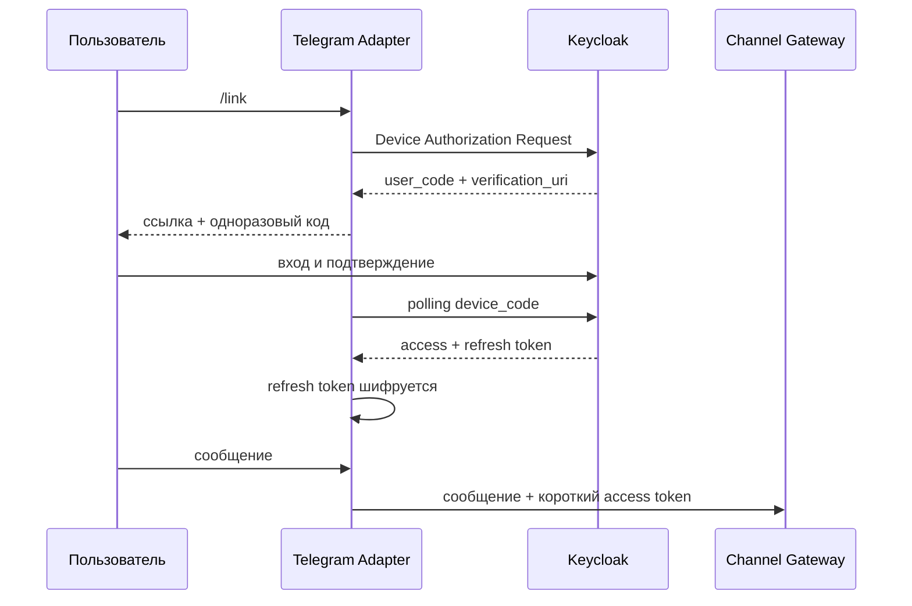

# Архитектура

## Границы

- Telegram user id используется только как ключ внешнего канала.
- Identity появляется только после подтверждения в Keycloak.
- Conversation Service хранит диалог.
- Action Service принимает решение и выполняет действие.
- Адаптер хранит только данные связи канала и зашифрованный refresh token.

Ключ шифрования приходит из secret manager через окружение. В Git и PostgreSQL открытого токена нет.
