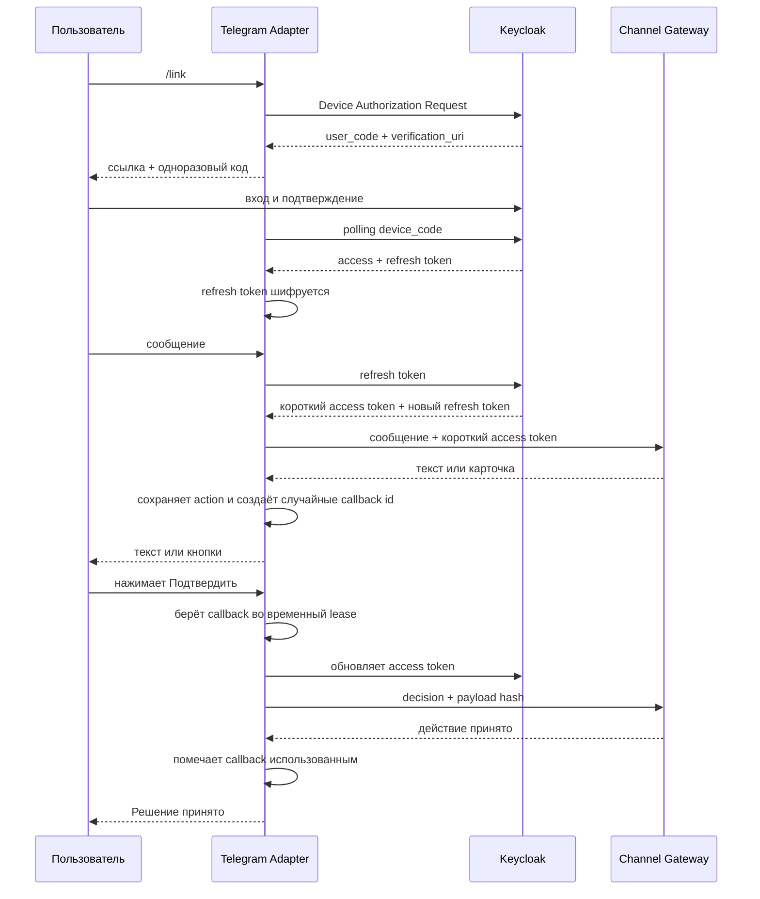

# Архитектура

## Границы

- Telegram user id используется только как ключ внешнего канала.
- Identity появляется только после подтверждения в Keycloak.
- Conversation Service хранит диалог.
- Action Service принимает решение и выполняет действие.
- Адаптер хранит только данные связи канала и зашифрованный refresh token.
- `update_id` становится стабильным `requestKey`, поэтому повтор webhook не создаёт второе действие.
- `conversationId` сохраняется рядом со связью, чтобы следующие сообщения продолжали тот же диалог.
- Telegram получает только случайный callback id. `actionId`, `payloadHash` и решение хранятся на
  стороне адаптера.
- Lease не позволяет двум worker обработать одно нажатие одновременно. После ошибки зависимости
  lease снимается, поэтому пользователь может повторить действие.

Ключ шифрования приходит из secret manager через окружение. В Git и PostgreSQL открытого токена нет.
